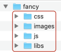
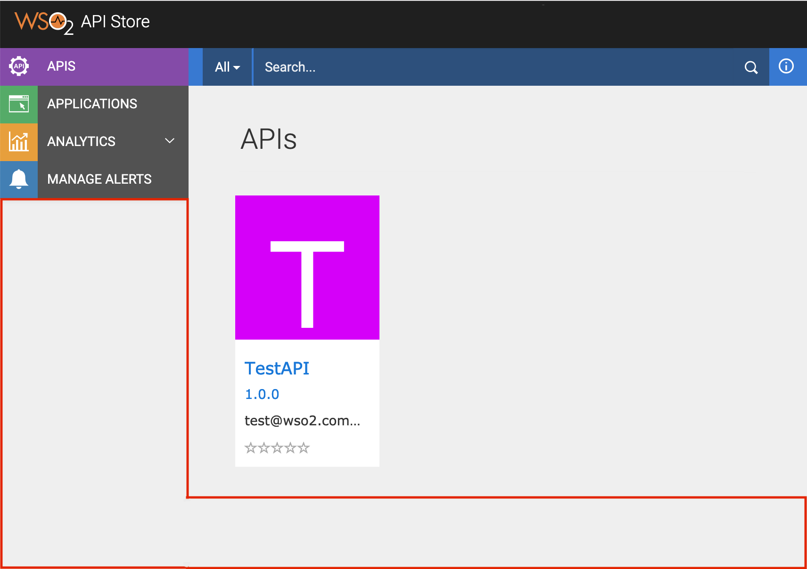
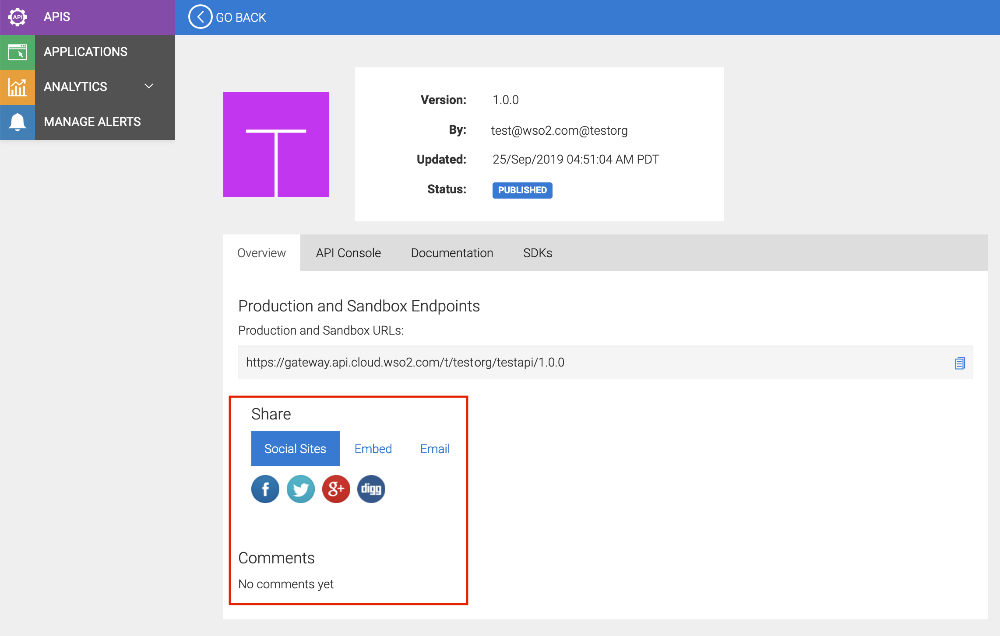
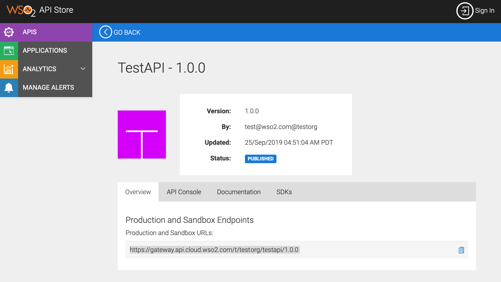
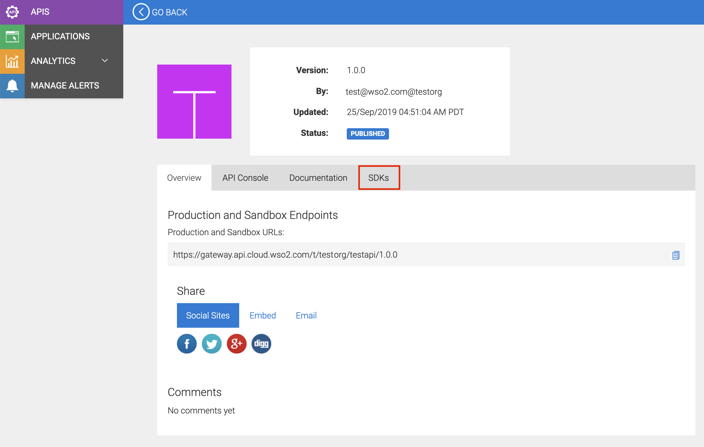
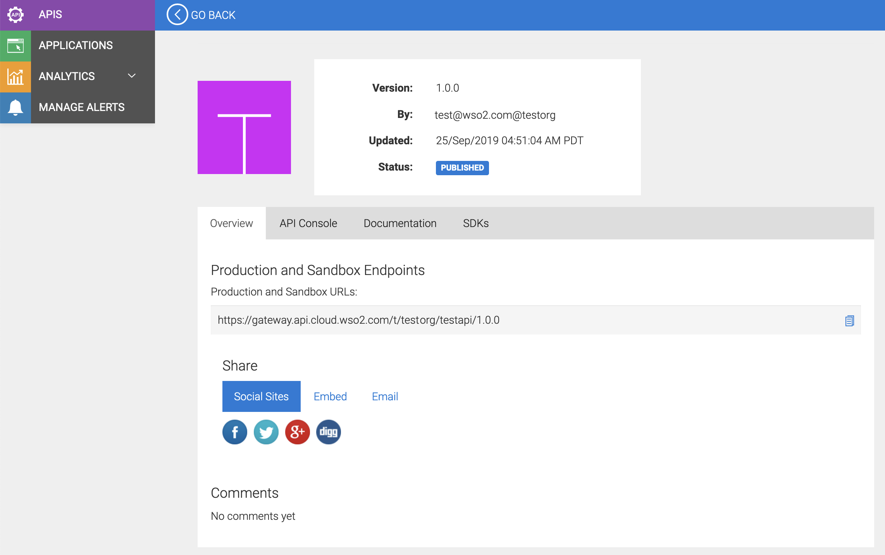
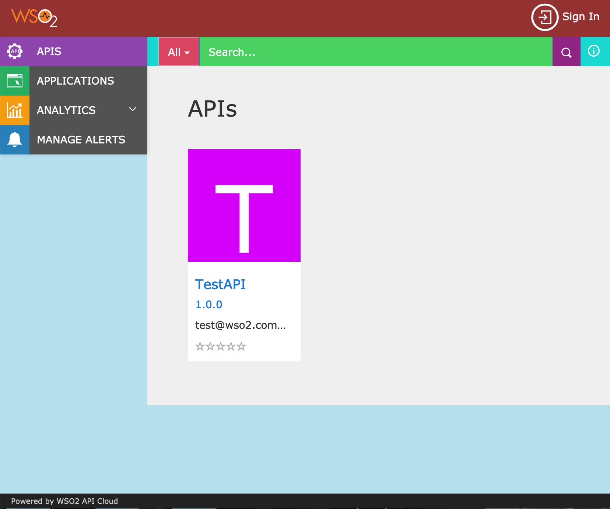

# Customize the API Store Theme

A theme consists of logos, images, color scheme, layout, style elements
and so on, which contribute towards the overall look and feel of a
website. Therefore, a theme directly reflects your brand identity and
represent who you are to your partners and customers. WSO2 API Store
comes with a default theme named *Fancy* , which defines the basic look
and feel of the API Store. Since the capability to customize an API
portal with your own corporate logos and styles is an important
requirement when it comes to APIs, WSO2 API Cloud allows you to
customize the look and feel of the API Store depending on your
preference.

Let's get started!

All themes have a folder structure similar to the following:
    


!!! note
    
    Since the default theme already has most of the UIs and JSON logic
    defined, in a typical scenario, you would not implemen the theme from
    scratch. You can customize the default theme by bundling together the
    changes (e.g., CSS code, images) as a .zip file, and uploading it
    through the Admin Dashboard Web application. Once uploaded, the files in
    the .zip override the corresponding files in the default theme. The rest
    is inherited from the default theme.
    
    
    -   To override the default theme, ensure that you upload UI changes,
        fonts, and images as follows:
        -   UI changes as CSS code.
        -   Fonts in TTF, EOT, WOFF, WOFF2 or OTF formats.
        -   Images in JPG, PNG, SVG, or GIF formats.
    -   Jaggery files or Javascript files are not allowed in the custom
        theme due to security reasons. If you include any Jaggery files or
        Javascript files, such files will be discarded and your theme will
        not work properly.
    

**Here's a walk-though of the steps you can follow depending on the
customizations you want to apply**:

<html>
<div class="admonition info">
<p class="admonition-title">Before you begin</p>
<p>Download the default theme [fancy.zip](../assets/attachments/customize/schema_graphql.graphql), unzip it and then rename the folder to the name of your new theme (e.g., ancient). Let's call this folder `<THEME_HOME>` throughout this section.</p>
</div>
</html>
    

-   To change the logo of the API Store, replace
    `<THEME_HOME>/libs/theme-wso2_1.0/images/logo-inverse.svg         `
    with a preferred logo.
-   To change the logo of the API Store's self sign up page, replace the
    `<THEME_HOME>/images/logo-white.png` with a
    preferred logo.
-   If you want to make any of the customizations listed below,  open
    the `<THEME_HOME>/css/custom.css` file using a
    text editor and add the given CSS code block to the end of the file
    depending on the customization you want to apply:  
      
    -   To hide the API Store label on the header:  
        

        ``` css
        .display-block-xs {
             visibility: hidden;
        }
        ```

        Applying the code block results in the following:  
        

      
    -   To change the color of the header:  
        

        ``` css
        header.header-default {
            background: #893936 none repeat scroll 0 0;
                }
        ```

        Applying the code block results in the following:  
         

      
    -   To change the color of the top navigation bar:  
        

        ``` css
        .navbar {
            background: #1ad8d1 none repeat scroll 0 0;
        }
        ```

        Applying the code block results in the following:  
        

      
    -   To change the color of the search box and its fonts:  
        

        ``` css
        .search-wrap .appm-content-search {
            background: #49d162;
            color: #000000;
        }
        
        .appm-content-search::-moz-placeholder {
            color: #49d162;
        }
        ```

        Applying the code block results in the following:  
         

      
    -   To change the color of the search button:  
        

        ``` css
        .search-wrap .btn.wrap-input-right {
            background: #555555;
        }
        ```

        Applying the code block results in the following:  
        

      
    -   To change the color of the drop-down list of API categories you
        can search:  
        

        ``` css
        .search-wrap .btn.dropdown-toggle {
            background: #eb3f3f none repeat scroll 0 0;
            border-color: #444444;
        }
        ```

        Applying the code block results in the following:  
        

      
    -   To change the font of the menus, headings, and labels to
        Verdana:

        !!! tip
        
                You can specify several fonts in order of preference to ensure
                maximum compatibility in case one font fails in a given
                browser/OS. If the first font you have listed fails, the next
                font in the list will be applied.
        

        ``` css
        body,textarea,pre,.navbar-search .search-query{
            font-family: Verdana, Arial, Helvetica, monospace, san-serif;
        }

        label, input, button, select, textarea{
            font-family: Verdana, Arial, Helvetica, monospace, san-serif;
        }

        h1,h2,h3,h4,h5{
            font-family: Verdana, Arial, Helvetica, monospace, san-serif;
        }
        ```

      
    -   To change the background color:  
        

        ``` css
        body{
            background: #b7e0ed;
        }
        ```

        Applying the code block results in the following:  
        

      
    -   To change the color of the buttons:

        !!! tip
        
                When changing the color of buttons, changing only the background
                color will not have a visual impact if you leave the gradient as
                it is.
        

        ``` css
        .btn-primary {
          background-color: #800004;
          background-image: linear-gradient(to bottom, #cc0022, #cc0044);
        }
        ```

     
    -   To hide the social media and collaboration icons from the
        **Overview** section of an API:  
        

        ``` css
        .share-container{
        display: none;
          }
        
        #tab0  ul {
        display: none;
        }
        
        #tab0 .col-md-12 .col-lg-9 > .add-margin-top-5x {
        display: none;
        }
        
        #comment-list{
        display:none;
        }
        ```

        !!! note
        
                To completely hide the comments section. You need to open the
                `<THEME_HOME>/js/script.js` file using
                a text editor and add the following script code:
        
                ``` java
                $('#comment-list').parent().hide()
                ```
        

        Applying the code block and `script.js            `
        changes will result in the following:  
        

      
    -   To hide the SDKs tab of APIs:  
        

        ``` css
        .nav-tabs li:nth-child(4){
        display: none;
        }
        ```

        Applying the code block results in the following:  
        

     
    -   To hide the **More APIs** section displayed at the bottom when
        viewing a particular API via the Store:  
        

        ``` css
        .truncate-children{
        display:none;
        }
        
        div.body-wrapper div:nth-child(4){
        display: none;
        ```

        Applying the code block results in the following:  
        


-   If you want to edit the name of the API author, which is displayed
    as `<your_email_address>@<your_organization_key>`
    by default, follow the steps below:  
     
    1.  On the API Publisher, browse to the API for which you want
        change the author, and then click **EDIT API** .
    2.  Navigate to the **Manage** tab.
    3.  Expand the **Business Information** section and specify
        appropriate values for the fields.

        !!! tip
        
                The value that you specify in the **Business Owner** field will
                be displayed as the API author.
        

        

    4.  Click **Save & Publish** . This updates the author of the API.
        You can go to the API Store to view the updated author.  
        

Once you are done with all the required customizations, you are ready to
upload your theme changes as a sub-theme of the default main theme.

!!! note
        
   
    Before you upload your theme customizations, you need to delete all the
    files except the ones that you just edited in your
    `<THEME_HOME>` folder. The rest of the files will be
    automatically applied from the main theme.

  

Follow the steps below to upload your theme customizations:

1.  Go to the `<THEME_HOME>` folder, **select all
    the files/folders inside it, then (Ctrl+A) and right click** to
    archive all the selected files and folders together.

    !!! tip
    
        **Tip** : Be sure to select all the files/folders (Ctrl+A) and right
        click on all the selected artifacts to create the archive file.
    

2.  Rename the archive file to
    `ancient.zip`.
3.  Sign in to WSO2 API Cloud. This takes you to the API Publisher Web
    application.
4.  Click **Admin Dashboard** under the **Configure** menu. This opens
    the Admin Dashboard.  
    
5.  Click **SETTINGS** and then click **UPLOAD TENANT THEME** .
6.  Upload your zip file (e.g., ancient.zip).  
    
7.  Open the API Store to take a look at the customizations that are
    applied.

    !!! tip
    
        **Tip** : It can take up to 15 minutes for a new theme to be applied
        to the API Store.
    

      
    Similarly, open the sign up page to take a look at the
    customizations applied there.  
     

Now you have successfully applied the most common customizations to the
API Store.

  
