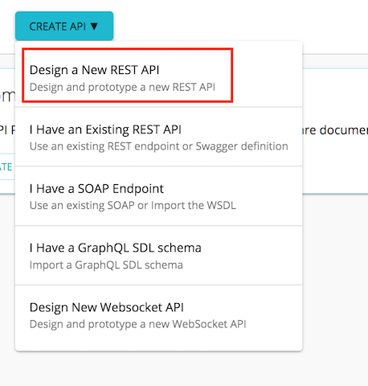

# Quick Start Guide

This section provides step-by-step instructions to quickly create, publish, and invoke an API via WSO2 API Cloud's Publisher Portal and DevPortal.

## Objectives

1. Create and publish an API via the API Publisher portal.
2. Subscribe to the API via the DevPortal.
3. Generate keys.
3. Invoke the API with the generated keys.

Let's get started!

### Step 1 - Create and publish your first API

Follow the instructions below to create and publish an API via the API Publisher Portal.

1. Sign in to WSO2 API Cloud using your username and password. This opens the API Publisher portal.
                                                

2. Create an API.

     Let's use a mock REST service to create the API from scratch.
 
     1. Navigate to [https://www.mocky.io/](https://www.mocky.io/) on your web browser. 
             
         A mock service with a JSON response `{"hello": "world"}`  is provided by default on the landing page of the site. Let's use the  service URL (`http://www.mocky.io/v2/5185415ba171ea3a00704eed`) that appears in the mock service. Note that we are using the HTTP protocol instead of HTTPS.

        
         
     2. To test this service, copy the service URL [http://www.mocky.io/v2/5185415ba171ea3a00704eed](http://www.mocky.io/v2/5185415ba171ea3a00704eed) and navigate to it on a new browser. You should see the following JSON message.
            
         `{"hello": "world"}`
    
4. Click **CREATE API** and then click **Design a new REST API**.
 

5. Provide the following as the API details.

    <table>
    <tr> 
     <th>
     Name
     </th>
     <td>
     HelloWorld
     </td>
     </tr>
     <tr> 
     <th>Context
     </th>
     <td><code>/hello</code>
     </td>
     </tr>
     <tr> 
     <th>Version
     </th>
     <td>1.0.0
     </td>
     </tr>
     <tr> 
     <th>Endpoint
     </th>
     <td><code>http://www.mocky.io/v2/5185415ba171ea3a00704eed</code>
      

      
Note

      
<b>Use the HTTP protocol</b>. If you want to use HTTPS you would have to import the <code>mocky.io</code> certificate.

      
 
     </td>
     </tr>
     <tr> 
     <th>Business Plan(s)
     </th>
     <td>Gold, Bronze
     </td>
     </tr>
     </table>

        
6. Click **Create & Publish**. 

     This will publish the API on the DevPortal. You now have an OAuth2.0 secured REST API that is ready to be consumed.

### Step 2 - Subscribe to the API

Follow the instructions below to subscribe to the API and generate the keys via the DevPortal.

1. Navigate to the DevPortal. You will see the published `HelloWorld` API listed in the DevPortal.

2. Click on the API thumbnail to view the overview of the API. 

3. Register an OAuth2.0 application.

    1. Click **Subscribe** on the **Subscriptions** card.
    
    2. Click **Subscription & Key Generation Wizard**. This wizard walks you through 5 steps that will register an OAuth2.0 application, which you can use to consume the `HelloWorld` API.  

    3.  Create the OAuth2.0 application.
    
         Enter the application name, and click **Next** without changing any of the other default values.   

         <table>
         <tr> 
         <th>
         Application Name
         </th>
         <td>
         Greetings
         </td>
         </tr>
         <tr> 
         <th>Per Token Quota
         </th>
         <td>50PerMin
         </td>
         </tr>
         <tr> 
         <th>Token Type
         </th>
         <td>JWT
         </td>
         </tr>
         </table>

     3. Subscribe the application to the API.  
        
         This subscribes the `Greetings` application to the `HelloWorld` API on the selected business plan. Click **Next** without changing any of the default values.

     4. Generate the credentials for the **Greetings** OAuth2.0 application. 
     
         The Grant Types define the various protocols allowed by the system, from which your application will be allowed to request tokens. Click **Next** without changing any of the default values.

     5. Generate a test access token for the 'Greetings' application to access the 'HelloWorld' API. 
     
         This step allows you to specify the validity period for the token and the permissions (scopes). Click **Next** without changing any of the default values.

     6. Click copy to copy the generated test access token to the clipboard.

     7.  Click **Finish**.

 **Voila!!!** You can now test the 'HelloWorld' API with the OAuth2.0 token that you just generated. 

### Step 3 - Invoke the API

Follow the instructions below to use the generated keys to invoke the API you created.

1. Click **Try Out**. 

     You will see the resources of the API are listed. 

2. Paste the access token that you previously copied in the **Access Token** field.  

3. __If this is the first time you are using the API test console__ from your browser,  open a new tab and navigate to the [https://localhost:8243/](https://localhost:8243/) URL. 

     This will prompt your browser to accept the certificate used by the API Gateway. This is required because by default the API Gateway uses a self-signed certificate that is not trusted by web browsers. 
    
    !!! note

        This certificate used by the API Gateway is replaced when deploying the system in production.

4. Click `GET` resource of the API to expand the resource. 

5. Click **Try It Out**, which is the button on the right. Then click **Execute**.  

     You should see the `{"hello" : "world"}` response from the API.  

__Congratulations!__ You have successfully created your first API, subscribed to it through an OAuth2.0 application, obtained an access token for testing, and invoked your API with the access token.  
