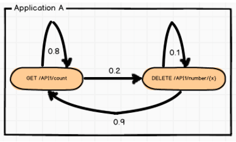
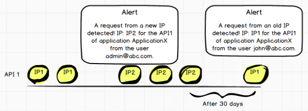
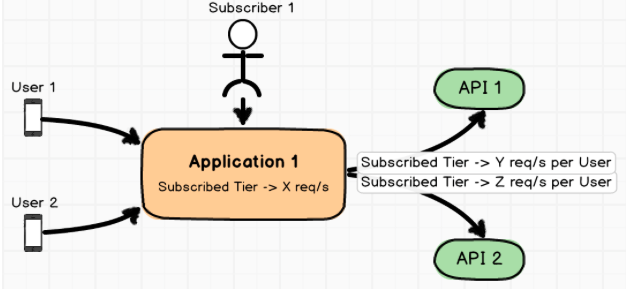

# Alert Types

WSO2 API Cloud supports various alert types to monitor API-related statistics for different purposes. Some of the common scenarios that require alerts include a sudden failure of one or more APIs, a sudden increase in the response time of one or more APIs, a change in the pattern of API resource access etc.

Depending on your requirement, you can configure and subscribe to the alert types that you want to have.

WSO2 API Cloud currently supports the following alert types:
-   Abnormal response time
-   Abnormal backend time
-   Abnormal request counts
-   Abnormal resource access pattern
-   Unseen source IP address
-   Frequent tier limit hitting (tier crossing)
-   Availability of APIs (API health monitoring)

### Abnormal response time

|                       |                                                                                                                                                                                                              |
|-----------------------|--------------------------------------------------------------------------------------------------------------------------------------------------------------------------------------------------------------|
| Reason for triggering | When there is a sudden increase in the response time of a specific API resource.                                                                                                                               |
| Indication            | Slow WSO2 API Cloud runtime, or slow backend.                                                                                                                                                              |
| Description           | This alert gets triggered when the response time of a particular API for which this alert type is configured is higher than the configured threshold value. These alerts can be an indication of a slow runtime or backend. |

### Abnormal backend time

|                       |                                                                                                                                                                                        |
|-----------------------|----------------------------------------------------------------------------------------------------------------------------------------------------------------------------------------|
| Reason for triggering | When there is a sudden increase in the backend time corresponding to a particular API resource.                                                                                          |
| Indication            | Slow backend                                                                                                                                                                           |
| Description           | This alert gets triggered when the backend time corresponding to a particular API for which this alert type is configured is higher than the configured threshold value. These alerts can be an indication of a slow backend. |

### Abnormal request counts

|                       |                                                                                                                                                                                                                                                                                                                |
|-----------------------|----------------------------------------------------------------------------------------------------------------------------------------------------------------------------------------------------------------------------------------------------------------------------------------------------------------|
| Reason for triggering | When there is a sudden spike or a drop in the request count within a period of one minute by default for a particular API resource.                                                                                                                                                                              |
| Indication            | These alerts can be considered indications of high traffic, suspicious acts or the malfunction of client applications etc.                                                                                                                                                           |
| Description           | This alert is triggered when there is a sudden spike in the request count within a period of one minute by default for a specified API of an application for which this alert type is configured. These alerts can be an indication of possible high traffic, suspicious activity etc. |

### Abnormal resource access pattern

|                       |                                                                                                                                                                                                                                                                                                                                                                                                                                                                                                                                                             |
|-----------------------|-------------------------------------------------------------------------------------------------------------------------------------------------------------------------------------------------------------------------------------------------------------------------------------------------------------------------------------------------------------------------------------------------------------------------------------------------------------------------------------------------------------------------------------------------------------|
| Reason for triggering | When there is a change in the resource access pattern of a user who uses a particular application.                                                                                                                                                                                                                                                                                                                                                                                                                                                            |
| Indication            | These alerts can be considered as an indication of a suspicious activity made by a user over your application.                                                                                                                                                                                                                                                                                                                                                                                                                                               |
| Description           | A Markov Chain model is built for each application to learn its resource access pattern. For the purpose of learning the resource access patterns, no alerts are sent during the first 500 (default) requests. After learning the normal pattern of a specific application, WSO2 Analytics performs a real time check on a transition done by a specific user, and sends and alert if it is identified as an abnormal transition. For a transition to be considered valid, it has to occur within 60 minutes by default, and it should be by the same user.         The above diagram depicts an example where a Markov Chain model is created during the learning curve of the system. Two states are recorded against Application A and the arrows show the directions of the transitions. Each arrow carries a probability value that stands for the probability of a specific transition taking place. Assume that the following two consecutive events are received by the application from user john@abc.com.    1. `DELETE /API1/number/1`   2. `DELETE /API1/number/3`    The above transition has happened from the `DELETE /API1/number/{x}` state to itself. According to the Markov chain model learnt by the system, the probability of this transition occurring is very low. Therefore, an alert is sent.    This alert is triggered if there is a change in the resource access pattern of a user of a particular application. These alerts could be treated as an indication of a suspicious activity made by a user over your application.                                                                                                                                                                                                                                                                                                                             |

### Unseen source IP address

|                       |                                                                                                                                                                                                                                                                                                                                                                                                                                                                                                                                                                         |
|-----------------------|-------------------------------------------------------------------------------------------------------------------------------------------------------------------------------------------------------------------------------------------------------------------------------------------------------------------------------------------------------------------------------------------------------------------------------------------------------------------------------------------------------------------------------------------------------------------------|
| Reason for Triggering | When there is either a change in the request source IP for a specific API of an application, or if the request if from an IP used before 30 days (default).                                                                                                                                                                                                                                                                                                                                                                                                               |
| Indication            | These alerts can be considered as an indication of a suspicious activity made by a user over an application.                                                                                                                                                                                                                                                                                                                                                                                                                                                             |
| Description           |     This alert is triggered if there is either a change in the request source IP for a particular application by a user or if the request is from an IP used before a time period of 30 days (default). The first 100 requests by a user are used only for learning purposes by default and therefore, no alerts are sent during that time. However, the learning would continue even after the first 100 requests by a user. This means, even if you receive continuous requests from the newly detected `IP2` IP, you are alerted only once.  |

### Frequent tier limit hitting (tier crossing)

|                       |                                                                                                                                                                                                                      |
|-----------------------|----------------------------------------------------------------------------------------------------------------------------------------------------------------------------------------------------------------------|
| Reason for Triggering | This alert is triggered in the following scenarios. <ul><li> When a particular application is throttled for reaching a subscribed tier limit more than the specified number of times during a defined period (10 times within an hour by default).</li><li>When a particular user of an application is throttled for reaching a subscribed tier limit of a specific API more than the specified number of times during a defined period (10 times within an hour by default).</li></ul>

                                                                                                                                                                              |
| Indication            | These alerts indicate that you need to subscribe to a higher tier.                                                                                                                                                   |

### Availability of APIs (API health monitoring)

These alerts are triggered for the reasons specified in the following tables:

|                       |                                                                                                                                                                               |
|-----------------------|-------------------------------------------------------------------------------------------------------------------------------------------------------------------------------|
| Reason for Triggering | The response time of an API is greater than the upper percentile value specified for the same (which is 95 by default). This should occur continuously for a specified number of times (5 times by default). |
| Indication            | The response time is too high.                                                                                                                                                |

|                       |                                                                                                                                                                                                |
|-----------------------|------------------------------------------------------------------------------------------------------------------------------------------------------------------------------------------------|
| Reason for Triggering | The request count of an API per minute is less than the lower percentile value specified for the same (which is 5 by default). This should occur 5 times (i.e. 5 minutes) continuously in order to trigger the error. |
| Indication            | The request count per minute is normal, but the response count per minute is low.                                                                                                                                                              |

|                       |                                                                                                                                                                                                |
|-----------------------|------------------------------------------------------------------------------------------------------------------------------------------------------------------------------------------------|
| Reason for Triggering | The response status code is greater than or equal to 500, but less than 600. This should occur continuously for a specified number of times (5 times by default) in order to trigger an alert. |
| Indication            | A server side error has occurred.                                                                                                                                                              |

!!! info
     For more information on how API status changes depending on availability of APIs, see Availability Of APIs.

