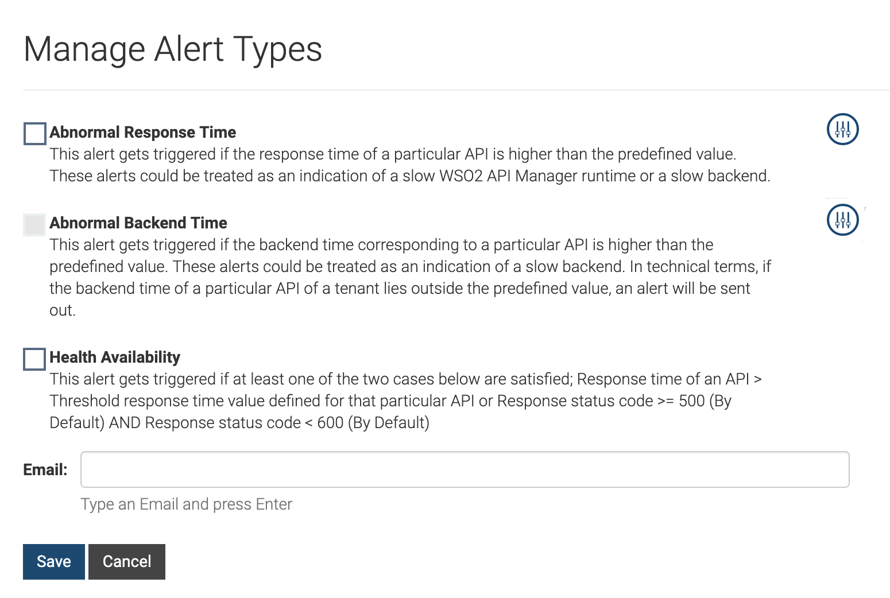
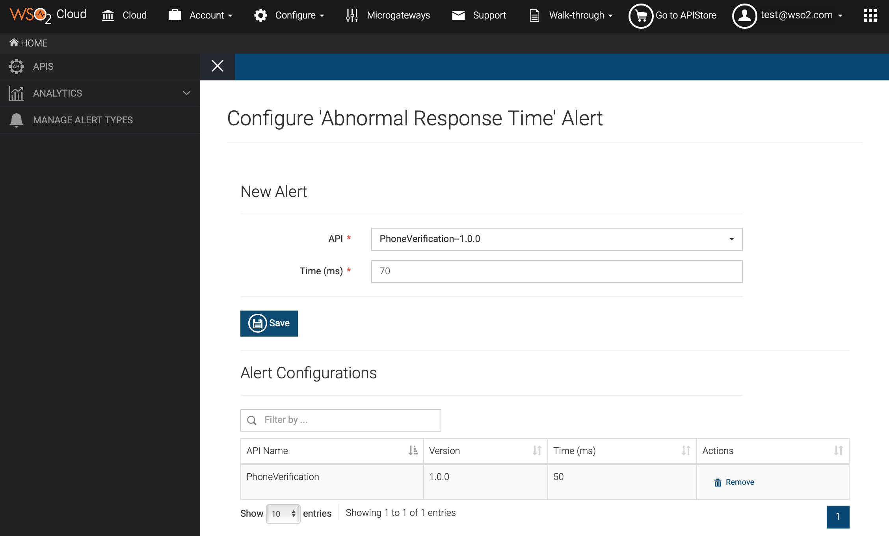
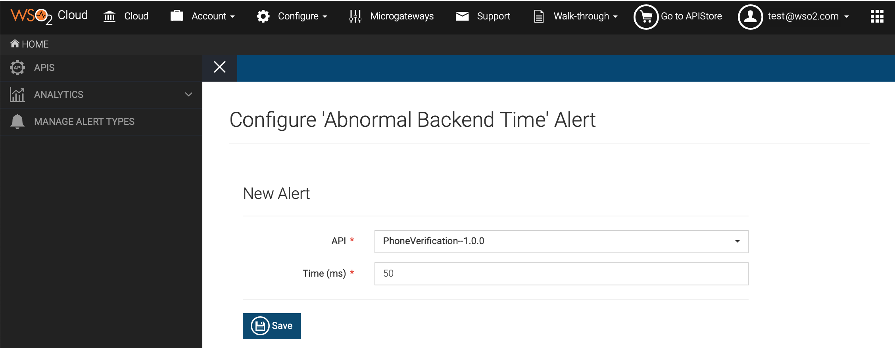
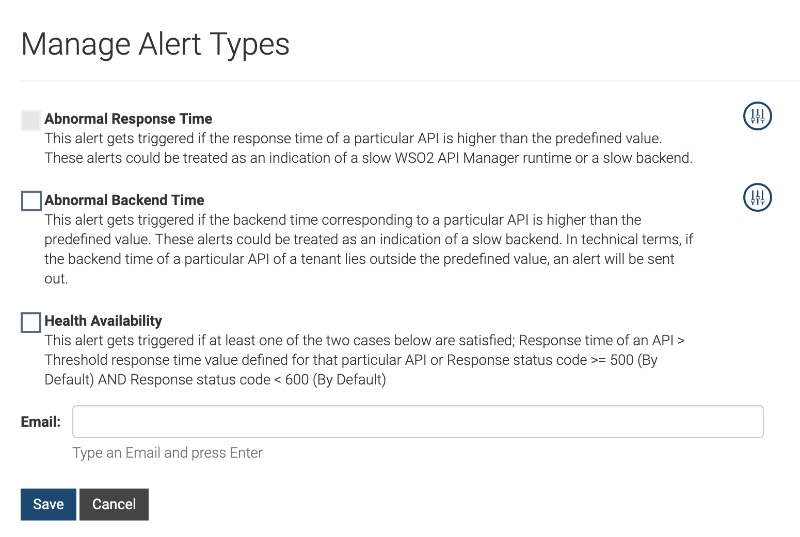
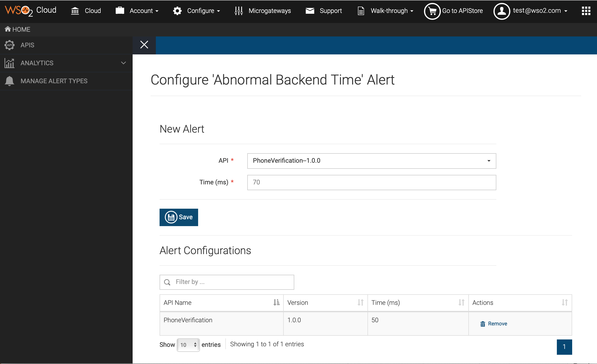
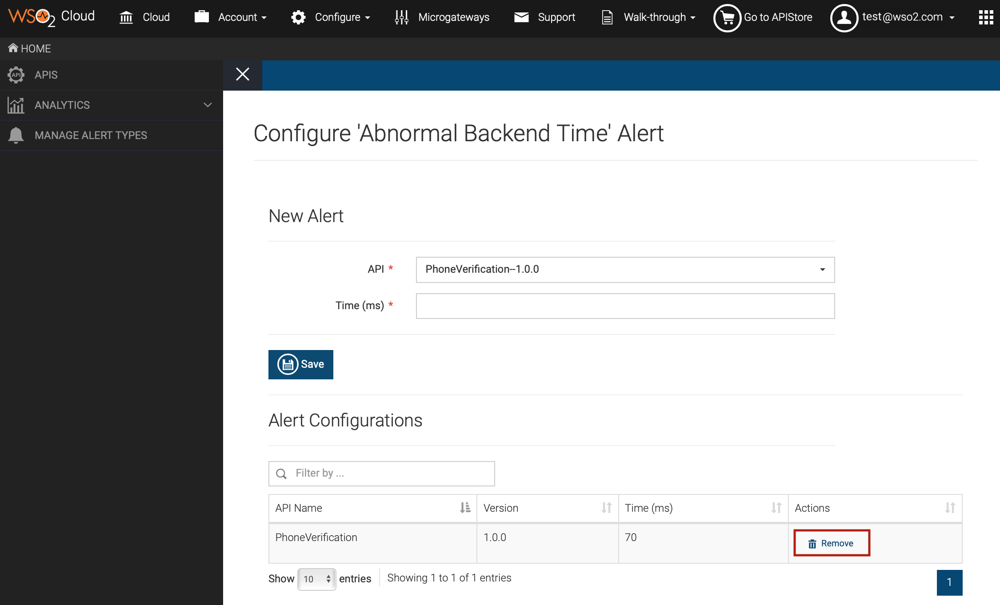
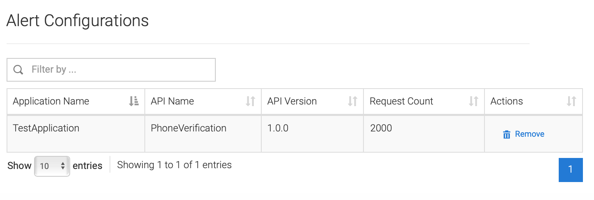
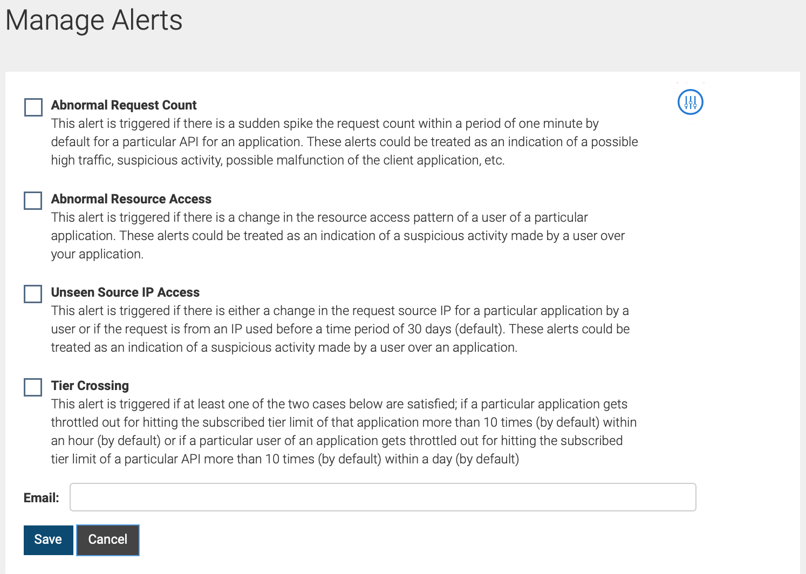
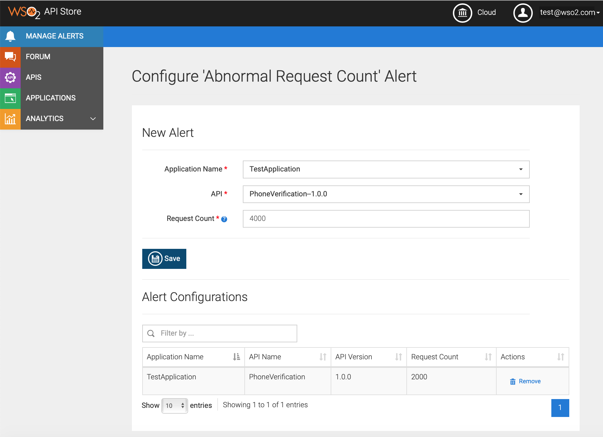
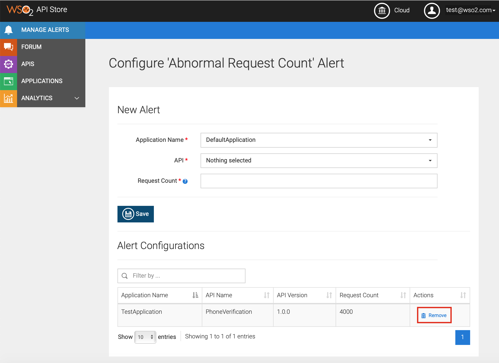

# Configure Alerts

WSO2 API Cloud supports various alert types to monitor API-related
statistics. Some alert types are enabled by default, which you can
subscribe right-away. However, There are a few alert types that you need
to first configure in order to be able to subscribe.

Depending on your requirement, go to the appropriate tab for
step-by-step instructions on configuring API Publisher alerts and API
Store alerts.

!!! note
    
    You need to be the API owner to configure alert thresholds for an API.
    
### Configure Publisher alerts

You can configure, update, or delete alerts of the following alert types
via the Publisher:

-   **Abnormal Response Time**
-   **Abnormal Backend Time**

The health availability
publisher alert type is enabled by default. You can
decide whether you want to subscribe to it depending on your
requirement. For instructions on how to subscribe to this alert type,
see [Subscribe to
alerts](../subscribe-to-alerts).

The following topics provide instructions on how you can 
configure, update, or delete abnormal response time alerts.

#### Configure an abnormal response time alert

Follow the steps below to set up an abnormal response time alert for a
particular API:

1.  Sign in to [WSO2 API Cloud](https://api.cloud.wso2.com/publisher) with your credentials. This opens the API Publisher portal.
2.  Click **MANAGE ALERT TYPES.**  
      
    This displays the **Manage Alert Types** page.
3.  Click the settings icon that corresponds to the **Abnormal Response
    Time** alert.

    !!! note
    
        Note
    
        If you are configuring an **Abnormal Response Time** alert for the
        first time, you will see that the **Abnormal Response Time** alert
        check box is disabled.
    
      
      
    This displays the **Configure 'Abnormal Response Time' Alert** page
    where you can set up an **Abnormal Response Time** alert for an API.

4.  Select the **API** for which you need to set up the alert, and then
    specify the expected response **Time** in milliseconds.

    !!! tip
    
        When the response time of the API exceeds the specified time, an
        alert is triggered to indicate that the runtime or backend is slow.
    

    

5.  Click **Save** . This configures an **Abnormal Response Time** alert
    for the specified API.  
      
    When you configure at least one **Abnormal Response Time** alert ,
    and then go to the **Manage Alert Types** page, you can see that the 
    check box to select the **Abnormal Response Time** alert type is enabled.  
    

#### Update an abnormal response time alert

Follow the steps below to update the response time of an abnormal
response time alert that you have already set up:

1.  Sign in to [WSO2 API Cloud](https://api.cloud.wso2.com/publisher) with your credentials. This opens the API Publisher portal.
2.  Click **MANAGE ALERT TYPES.**  
       
    This displays the **Manage Alert Types** page.
3.  Click the settings icon that corresponds to the **Abnormal Response
    Time** alert.  
      
    This displays the **Configure 'Abnormal Response Time' Alert** page
    where you can update the response time of an alert that you have
    already set up.
4.  Select the API specified in the alert that you want to update, and
    then specify the new response time in milliseconds.  
    
5.  Click **Save** . This updates the response time of the alert.  
    

#### Delete an abnormal response time alert

Follow the steps below to delete an abnormal response time alert that
you have set up:

1.  Sign in to [WSO2 API Cloud](https://api.cloud.wso2.com/publisher) with your credentials. This opens the API Publisher portal.
2.  Click **MANAGE ALERT TYPES** .  
      
    This displays the **Manage Alert Types** page.
3.  Click the settings icon that corresponds to the **Abnormal Response
    Time** alert.  
    
4.  In the **Alert Configurations** section, click **Remove**
    corresponding to the alert entry that you want to delete.  
    
    This displays a message to confirm deletion.
5.  Click **Yes** to remove the alert entry.

The following topics provide instructions on how you can 
configure, update, or delete backend time time alerts.

#### Configure an abnormal backend time alert

Follow the steps below to set up an abnormal backend time alert for a
particular API:

1.  Sign in to [WSO2 API Cloud](https://api.cloud.wso2.com/publisher) with your credentials. This opens the API Publisher portal.
2.  Click **MANAGE ALERT TYPES.**  
      
    This displays the **Manage Alert Types** page.
3.  Click the settings icon that corresponds to the **Abnormal Backend
    Time** alert.

    !!! note
    
        Note
    
        If you are configuring an **Abnormal Backend Time** alert for the
        first time, you will see that the **Abnormal Backend Time** alert
        check box is disabled.
    

      
      
    This displays the **Configure 'Abnormal Backend Time' Alert** page
    where you can set up **Abnormal Backend Time** alerts for APIs.

4.  Select the API for which you need to set up the alert, and then
    specify the expected backend **Time** in milliseconds.

    !!! tip
    
        When the backend time of an API exceeds the defined time, an alert
        is triggered to indicate that the backend is slow. In technical
        terms, an alert is triggered when the backend time of a particular
        API of a tenant falls outside the predefined value.
    

    

5.  Click **Save** . This configures an **Abnormal Backend Time** alert
    for the specified API.  
      
    When you configure at least one **Abnormal Backend Time** alert ,
    and then go to the **Manage Alert Types** page, you can see that the 
    check box to select the **Abnormal Backend Time** alert type is enabled.
    
  

#### Update an abnormal backend time alert

1.  Sign in to [WSO2 API Cloud](https://api.cloud.wso2.com/publisher) with your credentials. This opens the API Publisher portal.
2.  Click **MANAGE ALERT TYPES.**  
      
    This displays the **Manage Alert Types** page.
3.  Click the settings icon that corresponds to the **Abnormal Backend
    Time** alert.  
      
    This displays the **Configure 'Abnormal Backend Time' Alert** page
    where you can update the backend time of an alert that you have
    already set up.
4.  Select the **API** specified in the alert that you want to update,
    and then specify the new backend **Time** in milliseconds.  
     
5.  Click **Save** . This updates the backend time of the alert.  
    

#### Delete an abnormal backend time alert

Follow the steps below to delete an abnormal backend time alert that you
have set up:

1.  Sign in to [WSO2 API Cloud](https://api.cloud.wso2.com/publisher) with your credentials. This opens the API Publisher portal.
2.  Click **Manage Alert Types** .  
      
    This displays the **Manage Alert Types** page.
3.  Click the settings icon that corresponds to the **Abnormal Response
    Time** alert.  
    
4.  In the **Alert Configurations** section, click **Remove**
    corresponding to the alert entry that you want to delete.  
      
    This displays a message to confirm deletion.
5.  Click **Yes** to delete the alert entry.

Once you configure required alerts, you can follow the instructions
[here](../subscribe-to-alerts)
to subscribe to WSO2 API Cloud Publisher alerts.

------------------------------------------------------------------------

### Configure Store alerts

You can configure, update, or delete **Abnormal Request Count** alerts
via the Store:

The following Store alerts are enabled by default:

-   **Abnormal Resource Access**
-   **Unseen Source IP Access**
-   **Tier Crossing**

You can decide whether you want to subscribe to these default alerts
depending on your requirement. For instructions on how to subscribe to
Store alerts, see [Subscribe to
alerts](../subscribe-to-alerts).

Click on a required topic for instructions depending on whether you want
to configure, update, or delete an alert.

#### Configure an abnormal request count alert

1.  Sign in to the [API Store](https://api.cloud.wso2.com/publisher) using your credentials. This opens the API Store. 
2.  Expand the **STATISTICS** menu, and then click **MANAGE ALERTS** .  
       
    This displays the **Manage Alerts** page.
3.  Click the settings icon that corresponds to the **Abnormal Request
    Count** alert.  

    !!! note
    
        Note
    
        If you are configuring an **Abnormal Request Count** alert for the
        first time, you will see that the **Abnormal Request Count** alert
        check box is disabled.
    

      
    This displays the **Configure 'Abnormal Request Count' Alert** page
    where you can set up **Abnormal Request Count** alerts.

4.  Select the **Application Name** for which you need to set up the
    alert.
5.  Select the **API** for which you need to set up the alerts.

    !!! tip
    
        Only the APIs that you have subscribed to by using the specified
        application are displayed.
    

6.  Specify the expected **Request Count** per minute.

    !!! tip
    
        When the request count of the API exceeds the defined time period,
        an alert is triggered. These alerts indicate possible high traffic,
        suspicious activity, possible malfunction of the client application
        etc.
    
     

7.  Click **Save** . This configures an **Abnormal Request Count** alert
    for the specified API resource.  
       
    When you configure at least one **Abnormal Request Count** alert ,
    and then go to the **Manage Alerts** page, you can see that the 
    check box to select the
    **Abnormal Request Count** alert type is enabled.
    

#### Update an abnormal request count alert

1.  Sign in to the [API Store](https://api.cloud.wso2.com/publisher) using your credentials. This opens the API Store.
2.  Expand the **STATISTICS** menu, and then click **MANAGE ALERTS** .  
      
    This displays the **Manage Alerts** page.
3.  Click the settings icon that corresponds to the **Abnormal Request
    Count** alert.  
      
    This displays the **Configure 'Abnormal Request Count' Alert** page
    where you can update the request count of an alert that you have
    already set up.
4.  Select the **Application Name** and **API** corresponding to the
    alert that you want to update, and then specify the new **Request
    Count** per minute .  
      
5.  Click **Save** . This updates the request count of the alert.  
     

#### Delete an abnormal request count alert

Follow the steps below to delete an abnormal request count alert that
you have set up:

1.  Sign in to the [API Store](https://api.cloud.wso2.com/publisher) using your credentials. This opens the API Store.
2.  Expand the **STATISTICS** menu, and then click **MANAGE ALERTS** .  
      
    This displays the **Manage Alerts** page.
3.  Click the settings icon that corresponds to the **Abnormal Request
    Count** alert.  
    
4.  In the **Alert Configurations** section, click **Remove**
    corresponding to the alert entry that you want to delete.
      
    This displays a message to confirm deletion.
5.  Click **Yes** to delete the alert entry.

Once you configure required alerts, you can follow the instructions
[here](../subscribe-to-alerts) to
subscribe to WSO2 API Cloud Store alerts.
