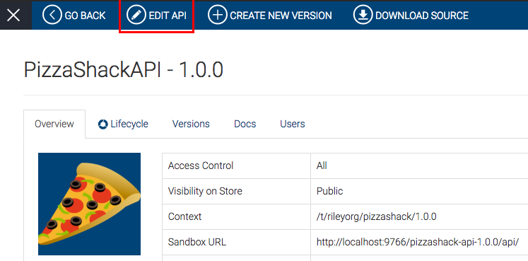
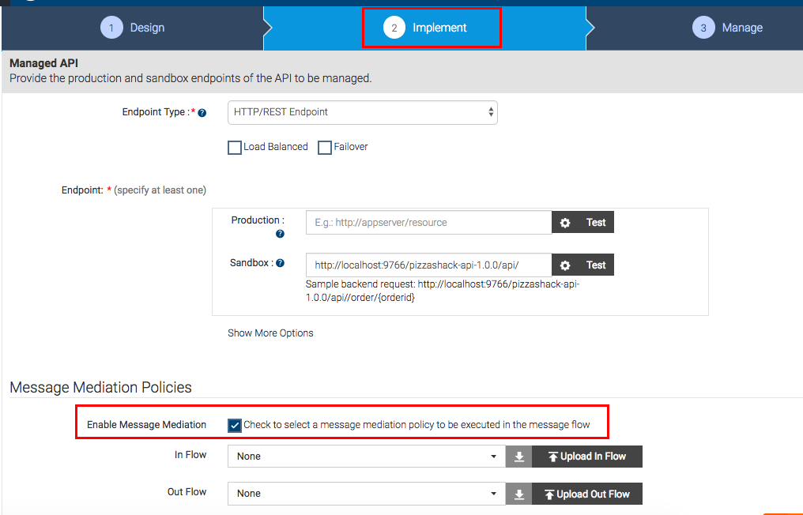

# Use OAuth2 Protected Backends

WSO2 API Cloud allows you to expose your backend APIs as managed and
secured APIs. API Cloud supports Basic and Digest OAuth protocols to
secure backend APIs. However, there can be situations where back-ends
are secured with OAuth2. This section describes how you can integrate WSO2
API Cloud with a backend secured with OAuth2.

!!! note
    
    Before you begin,
    
    1.  Create and publish an API. For step-by-step instructions, see [Create and Publish an aPI](../../tutorials/create-and-publish-an-api) 
    2.  Go to the API Store and subscribe to and invoke the
        API. For step-by-step instructions, see [Subscribe to and Invoke an aPI](../../tutorials/subscribe-to-and-invoke-an-api).
You will get an error from
        the backend saying credentials are missing in the request. This is
        because you are not passing the access token required for accessing
        the backend.
    

Follow the steps below to perform the configuration to generate and
pass an access token to the backend.

1.  Copy the following sequence and save it as an xml file.

    ``` java
    <?xml version="1.0" encoding="UTF-8"?>
    <sequence name="simple-token-gen" trace="disable" xmlns="http://ws.apache.org/ns/synapse">
        <property description="access_token" expression="get-property('registry', 'local:/api-backend-credentials/pizzaOrderingAPI/access_Token')" name="access_token" scope="default" type="STRING"/>
        <property description="generated_time" expression="get-property('registry','local:/api-backend-credentials/pizzaOrderingAPI/generated_Time')" name="generated-time" scope="default" type="LONG"/>
        <property description="client_credentials" name="app-client-auth" scope="default" type="STRING" value="{base64encoded(clientKey:clientSecret)}"/>
        <property expression="json-eval($)" name="message-body" scope="default" type="STRING"/>
        <property expression="get-property('axis2','REST_URL_POSTFIX')" name="resource" scope="default" type="STRING"/>
        <filter description="" xpath="get-property('SYSTEM_TIME') - get-property('generated-time') > 3600000 or get-property('access_token') = ''">
            <then>
                <payloadFactory media-type="xml">
                    <format>
                        <soapenv:Envelope xmlns:soapenv="http://schemas.xmlsoap.org/soap/envelope/">
                            <soapenv:Body>
                                <root xmlns="">
                                    <grant_type>client_credentials</grant_type>
                                </root>
                            </soapenv:Body>
                        </soapenv:Envelope>
                    </format>
                    <args/>
                </payloadFactory>
                <header expression="fn:concat('Basic', get-property('app-client-auth'))" name="Authorization" scope="transport"/>
                <header name="Content-Type" scope="transport" value="application/x-www-form-urlencoded"/>
                <property description="messageType" name="messageType" scope="axis2" type="STRING" value="application/x-www-form-urlencoded"/>
                <property description="REST_URL_POSTFIx" name="REST_URL_POSTFIX" scope="axis2" type="STRING" value=""/>
                <call blocking="true">
                    <endpoint name="token">
                        <http method="post" uri-template="{token-endpoint-url}"/>
                    </endpoint>
                </call>
                <property expression="get-property('resource')" name="REST_URL_POSTFIX" scope="axis2" type="STRING"/>
                <property description="generated Time Setter" expression="get-property('SYSTEM_TIME')" name="local:/api-backend-credentials/pizzaOrderingAPI/generated_Time" scope="registry" type="LONG"/>
                <property description="generated_token" expression="json-eval($.access_token)" name="generated-access-token" scope="default" type="STRING"/>
                <property description="new Token setter" expression="get-property('generated-access-token')" name="local:/api-backend-credentials/pizzaOrderingAPI/access_Token" scope="registry" type="STRING"/>
                <header expression="fn:concat('Bearer', get-property('generated-access-token'))" name="Authorization" scope="transport"/>
                <payloadFactory media-type="json">
                    <format>
                        $1
                    </format>
                    <args>
                        <arg evaluator="xml" expression="get-property('message-body')"/>
                    </args>
                </payloadFactory>
            </then>
            <else>
                <header expression="fn:concat('Bearer', get-property('access_token'))" name="Authorization" scope="transport"/>
            </else>
        </filter>
    </sequence>
    ```

2.  In the saved xml file, replace the following placeholders with corresponding values.
    -   `{base64encoded(clientKey:clientSecret)}` -
        The client key and client secret, separated by a colon and
        base64 encoded.
    -   `{token-endpoint-url}` - The token
        endpoint URL of the backend authorization server.
3.  Sign in to the API Publisher.
4.  Select your API and click **Edit**.
    
5.  Go to the **Implement** tab and select **Enable Message
    Mediation.**
      
6.  Click **Upload In flow** and upload the saved sequence file.
      
7.  Save and publish the API.

You can now successfully invoke your API.
